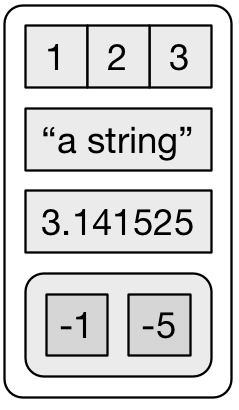

This talk based heavily upon the following sources
 - [Jenny Bryan's purrr tutorial](https://jennybc.github.io/purrr-tutorial/index.html)
 - [Hadley Wickham and Garrett Grolemund's R4DS](http://r4ds.had.co.nz/)
 - [Charlotte and Hadley Wickham's Datacamp Course](https://campus.datacamp.com/courses/writing-functions-in-r/)
 - [Charlotte Wickham's purrr tutorial](https://github.com/cwickham/purrr-tutorial)

---

```{r setup, include=FALSE}
options(htmltools.dir.version = FALSE)
library(tidyverse)
```

# Outline

- Basic data structures in R

- Why and when to write a function in R

- Functional Programming

- purrr::map

- purrr::walk

---
class: inverse, center, middle

# Data structures in R

---
# Two types of vectors

Atomic

Lists

---

# Atomic Vectors

Simple and strict; one data type at a time
- Used a lot
  - Logical 
  - Integer
  - Real (double, float)
  - Character

- Skipping these 
  - Complex
  - Raw


--

- What about factor? 
  - Integer vector with labels (levels)

--

Each type has its own NA


`NA` (logical), `NA_integer_`, `NA_real_`, `NA_character`, `NA_complex_`, `0` (raw)


---

# Lists
List can contain any of the atomic vectors AND lists!
.pull-left[
```{r comment='#'}
# a simple list
a <- list(a = 1:3
        , b = "a string"
        , c = pi
        , d = list(-1, -5))
```


Data frames are special types of lists.


]
  
.pull-right[


Image credit: [R4DS](http://r4ds.had.co.nz/lists.html)
]

---
class: center, middle

# NULL


--
`NULL` is the absence of a vector


---

class: inverse, center, middle

# Notebook Time
Vectors and data types

---

# Subsetting Lists/Dataframes/Tibbles

Three main ways to subset a List/df/tibble
- `[` returns a list/df/tibble with those elements
- `[[` returns an element from list/df/tibble
- `$` same as `[[`

There are many caveats and ways to do things:
http://adv-r.had.co.nz/Subsetting.html

Tibbles are strict about what they return. df's are less so: 
https://cran.r-project.org/web/packages/tibble/vignettes/tibble.html

---

class: inverse, center, middle

# Notebook Time
Subsetting data

---
# Functions in R

``` {r functionexample}
function01 <- function(argument1, argument2, ...) {
  #body where you do stuff
  #output
}
```

- Assignment `function1 <-`
- Function function `function() {}`
- formals or arguments
- Body
  - Code that solves your problem
- Output
  - last object is returned
  - can return something earlier with `return()`

Key realization: Functions are just like other R objects. You can use them in other functions.

http://adv-r.had.co.nz/Functions.html#function-components


---
# Why write a function?
``` {r Y_U_NO_function}
#Simple dataframe
df <- data.frame(
  a = rnorm(10),
  b = rnorm(10),
  c = rnorm(10),
  d = rnorm(10)
)
# What are we doing here?
df$a <- (df$a - min(df$a, na.rm = TRUE)) /  
  (max(df$a, na.rm = TRUE) - min(df$a, na.rm = TRUE))
df$b <- (df$b - min(df$b, na.rm = TRUE)) /  
  (max(df$b, na.rm = TRUE) - min(df$b, na.rm = TRUE))
df$c <- (df$c - min(df$a, na.rm = TRUE)) /  
  (max(df$c, na.rm = TRUE) - min(df$c, na.rm = TRUE))
df$d <- (df$d - min(df$d, na.rm = TRUE)) /  
  (max(df$d, na.rm = TRUE) - min(df$d, na.rm = TRUE))
```
No shame in doing this because it works, but it's error prone and lengthy. 

---

# How many repeats is too many?

Hadley's reasoning is that if you've got 3 copies of the same code then it's time to write a function. (I think that is reasonable.)


--
Also consider if you might reuse this again in another place. That counts as a repeat too!

---
# Simplify and functionalize

``` {r function01, error = TRUE, eval = FALSE}
df$d <- (df$d - min(df$d, na.rm = TRUE)) /  
  (max(df$d, na.rm = TRUE) - min(df$d, na.rm = TRUE))
```

--
``` {r function02, error = TRUE, eval = FALSE}
# pull out what's common, these are your arguments
x <- (x - min(x, na.rm = TRUE)) /  
  (max(x, na.rm = TRUE) - min(x, na.rm = TRUE))
```

--
``` {r function03, error = TRUE, eval = FALSE}

#simplify more and refactor if that makes sense
x <- (x - min(x, na.rm = TRUE)) /  
  diff(range(x, na.rm = TRUE))
```

--
``` {r function04, error = TRUE, eval = FALSE}
# rewrite as a function
rescale_0_1 <- function(x) {
  (x - min(x, na.rm = TRUE)) /  
  diff(range(x, na.rm = TRUE))
}
```

---

# Test it

Use simple data that you know what the output should be.

``` {r test function}
rescale_0_1 <- function(x) {
  (x - min(x, na.rm = TRUE)) /  
  diff(range(x, na.rm = TRUE))
}

testvec <- 1:11
testvec
rescale_0_1(testvec)
```
Does the result make sense? 

---

# Put it to work for you

``` {r use_function}
df <- data.frame(a = rnorm(10), b = rnorm(10), c = rnorm(10), d = rnorm(10))
rescale_0_1 <- function(x) {
  (x - min(x, na.rm = TRUE)) /  
  diff(range(x, na.rm = TRUE))
}
out <- df
out$a <- rescale_0_1(df$a)
out$b <- rescale_0_1(df$b)
out$c <- rescale_0_1(df$c)
out$d <- rescale_0_1(df$d)
out
```

---

# Function Writing Best Practices

- Make sure it does what you want it to do

- Use good names
  - functions do stuff; use verbs
  - arguments are things; use nouns
  - don't overwrite existing functions
  
- Argument order matters
  - `tidyverse` assumes data input comes first
  - detail arguments come later (e.g. `na.rm = TRUE`)

- Make output clear and obvious

The Tidyverse style guide is here:
http://style.tidyverse.org/

---

# What if we could take those repeats away too? 
``` {r still repeating, eval = FALSE}
out <- df
out$a <- rescale_0_1(df$a)
out$b <- rescale_0_1(df$b)
out$c <- rescale_0_1(df$c)
out$d <- rescale_0_1(df$d)
out
```
The function simplified the call, but we're copying and pasting again. 

🤔

---

# Iterate over a list

For Loop

``` {r forloops}
out <- df #make a copy to store scaled data
for (i in 1:ncol(df)) { # loop through each element
  out[i] <- rescale_0_1(df[[i]]) #apply function and store it to out
}
out
```


---
# seq_along
`seq_along()` generates the 1:end for you and handles 0 length 

``` {r for_seq_along_loops}
out <- df #make a copy to store scaled data
for (i in seq_along(df)) {
  out[i] <- rescale_0_1(df[[i]])
}
out
```


---

# Can we do better?

Iterate over df with `purrr::map`

``` {r map_over}
map(df, function(x) rescale_0_1(x))#map over the columns in df
```

---

class: inverse, center, middle


---
# purrr::map

`map` iterates over any list and always returns a list

``` {r simplemap}
l = list(a=1:10, b = 10:100)
map(l, function(x) mean(x, na.rm = TRUE))
```
Arguments/formals
  - `.x` list (or vector) to iterate over
  - `.f` function to apply over that list
  - `...` things that get passed from map() to .f

The names `.x` and `.f` are intentionally weird because they are unlikely to collide with other names passed through `...` to `.f`.
---

# more maps

Other types of `map` that return specific things
  - `map_lgl` logical 
  - `map_int` integer 
  - `map_dbl` double 
  - `map_chr` character 
  - `map_dfc` bind as columns into df
  - `map_dfr` bind as rows into df
  
``` {r rightmap}
l = list(a=1:10, b = 10:100)
map_dbl(l, function(x) mean(x, na.rm = TRUE))
```

``` {r wrongmap, error = TRUE}
map_lgl(l, function(x) mean(x, na.rm = TRUE))
```

These functions are "type-safe" and will fail with incorrect return type.

---

# Another example, assemble df from list output 
``` {r map_dfc_fingerlickingood}
map_dfc(df, function(x) rescale_0_1(x))#map over the columns in df
```

---

# Function definition shortcuts

Full anonymous function definition
``` {r functiondefintion, eval = FALSE}
l = list(a=1:10, b = 10:100)
map_dbl(l, function(x) mean(x, na.rm = TRUE))
```
Function name only, parameters passed through `...`
``` {r shortdefintion, eval = FALSE}
map_dbl(l, mean, na.rm = TRUE)
```
As a formula, object is passed as `.` or `.x`
``` {r formuladotdefintion, eval = FALSE}
map_dbl(l, ~mean(., na.rm = TRUE))
```
``` {r formuladotXdefintion}
map_dbl(l, ~mean(.x, na.rm = TRUE))
```

All return the same thing. 

---

class: inverse, center, middle

# Notebook Time
Map examples

---

# `map2` and `pmap`

What if you need elements from more than one list? 

For two lists use map2
`map2(.x, .y, .f, ...)`

For more, use pmap
`pmap(.l, .f, ...)`


---

class: inverse, center, middle

# Notebook Time
`map2` and `pmap` examples


---

# walk

If you're more interested in returning a side-effect than an object

`walk`


---